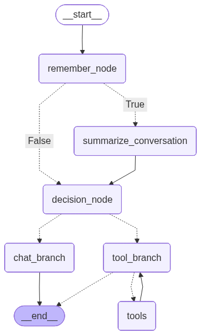

# LangGraph-Based Conversational Chatbot – Workflow Overview

This project implements a state-driven conversational chatbot using LangGraph, with explicit control over memory extraction, conversation summarization, decision-based tool usage, and final response generation.
The system is designed to avoid uncontrolled agent loops and redundant LLM calls while maintaining persistent conversational state.

## Core Workflow Philosophy
The chatbot does not operate as a free-form agent loop.
Instead, it follows a deterministic execution graph where:

- Deterministic execution using LangGraph
- Explicit decision-making before tool invocation
- Single final user-facing LLM response per turn
- Isolated memory and summarization steps
- Persistent, multi-turn conversation state

The chatbot follows a graph workflow, not a free-form agent loop.

## End-to-End Conversation Workflow

### 1. User Input & State Initialization
- User submits a message via the Streamlit UI.
- The message is appended to ChatState.messages as a HumanMessage.
- Each conversation is associated with a persistent thread ID. 

### 2. User Memory Extraction
- Reads only the latest user message.
- Uses a dedicated memory extraction prompt and model.
- Extracts user-specific, long-term facts only.
- Stores memory entries only if they are:
    - Relevant
    - Non-duplicative
- Memory is stored externally and does not pollute the conversation state.

### 3. Short Term Memory
- Triggered when the message history exceeds a threshold.
- Responsibilities:
    - Maintain a rolling conversation summary.
    - Remove older messages using RemoveMessage.
    - Preserve:
        - System-level summary
        - Most recent turns verbatim
- This step prevents:
    - Context window overflow
    - Latency growth
    - Token cost explosion

### 4. Tool Requirement Classification
- A dedicated decision model analyzes the latest user message.
- The model determines whether:
    - A direct LLM response is sufficient, or
    - One or more external tools are required
- The decision output controls the next transition in the graph.
- Outcome:
    - If no tools are needed → route to response generation
    - If tools are required → route to tool execution
- This explicit gating prevents unnecessary tool calls.

### 5. Response Generation Node
- The generation model receives:
    - Full conversation history
    - Tool outputs (if any)
- Retrieved document context (when available)
- The LLM generates a final response grounded in the updated state.
- The response is appended as an AIMessage.

### 6. Tool-Aware Response Path
- This node handles both:
    - Tool-aware LLM invocation
    - Final response generation after tool execution
- Flow
    1. LLM is invoked with tool awareness.
    2. If tools are required:
        - Execution transitions to the tools node.
    3. Tool outputs are appended as ToolMessages.
    4. Control returns to tool_branch.
    5. The final user-facing response is generated exactly once.
- This design eliminates duplicate LLM calls and ensures:
    - Lower latency
    - Reduced cost
    - Clear reasoning flow

### 7. External Tool Execution
- Executes only the tools explicitly requested by the model.
- Tool outputs are added to the conversation state.
- No reasoning or response generation occurs here.

## Document-Aware Workflow (When PDFs Are Used)
When documents are uploaded:
1. PDFs are loaded and split into chunks.
2. Embeddings are generated for each chunk.
3. Vectors are stored persistently using FAISS.
4. During response generation:
    - Relevant chunks are retrieved
    - Retrieved context is injected into the LLM input
5. The chatbot produces context-aware answers grounded in uploaded documents.

## Conversation Persistence Workflow
This enables long-running, multi-turn interactions without losing context.
- Each chat session is associated with a unique thread ID.
- Conversation state is stored using LangGraph checkpointing.
- Users can:
    - Resume previous conversations
    - Switch between threads
    - Reset sessions without losing stored data

## Features
- Deterministic execution over probabilistic agent loops
- Controlled tool usage to reduce unnecessary calls
- Clear separation between decision-making and response generation
- Persistent state for realistic conversational behavior
- Scalable foundation for production hardening